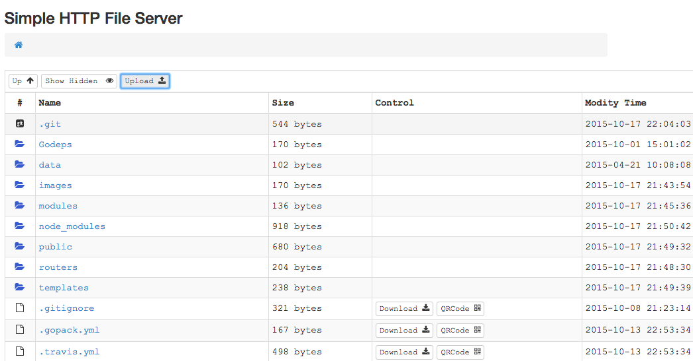
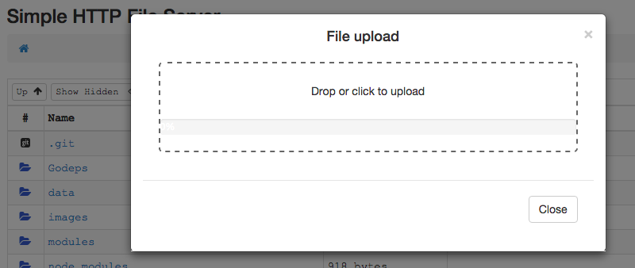

# File Static Server
A http file server written by golang and reactjs.

Binary can be download from [gorelease](http://gorelease.herokuapp.com/codeskyblue/file-server)

## Usage
	file-server -port 8000 -root /your/workdir

	file-server
		-port=8000: Which port to listen
		-private=false: Only listen on lookback interface, otherwise listen on all interface
		-root=".": the HTTP File Server's root directory
		-auth="": Basic Authentication (ex: username:password)

## Features
1. Support QRCode code generate
1. All assets package to Standalone binary
1. Different file type different icon
1. Support show or hide hidden files
1. Upload support
1. README.md preview
1. HTTP Basic Auth
1. Gzip support
1. When only one dir under dir, path will combine two together
1. Directory zip download
1. Code preview
1. Apple ipa auto generate .plist file, qrcode can be recognized by iphone (Require https)

About **https**

There is a [Chinese doc about how to set up nginx and generate self signed keys](docs/CA_NGINX.md)

## Build
Suggest install node through [nvm](https://github.com/creationix/nvm)

	go get -u github.com/jteeuwen/go-bindata/...
	npm install -g webpack
	npm install
	make prod

### Develop
Your need to know what is react, and golang.
In develop mode, Support react hot reload

	npm install
	make dev

Open another terminal

	go build && ./file-server

### API
Upload

`POST /upload-dir`

Field name | Description | Example
-----------|-------------|--------
file       | Upload file | file=@upload.txt
path       | Upload path(optional) | path=/tmp/
name       | Save name (optional, need version set)  | name=foo
version    | Upload version | version=1.2.0

Use CURL

	# Normal upload
	curl -F file=@upload.txt ${SERVER}

	# Versioned upload
	curl -F file=@foo-windows.txt -F file=@foo-mac.txt -F name=foo -F version=1.0.1 ${SERVER}

	# will create dir structure
	foo/
	  |- foo-latest(symlink) -> foo-1.0.1
	  `- foo-1.0.1/
	      |- foo-windows.txt
	      `- foo-mac.txt

## Thanks
1. <https://github.com/shenfeng/http-watcher>
2. <http://segmentfault.com/a/1190000002551952>
3. [update package.json dependencies](http://stackoverflow.com/questions/16073603/how-do-i-update-each-dependency-in-package-json-to-the-latest-version)
4. [react hot reload QA](https://github.com/gaearon/react-hot-loader/blob/master/docs/Troubleshooting.md)
5. <https://github.com/evilstreak/markdown-js>
