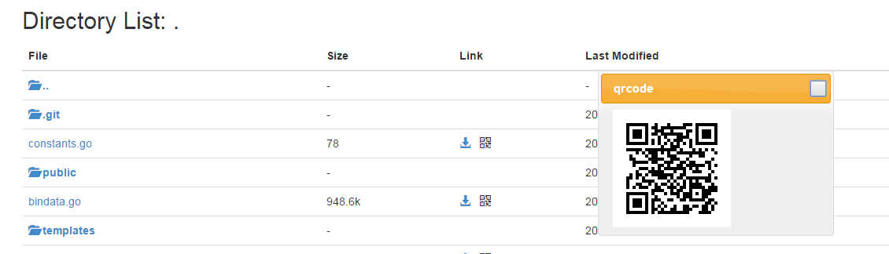

# File Static Server
[](http://gorelease.herokuapp.com/codeskyblue/file-server)

This is file server writen by golang.

http-watcher的简化版，除去了其他东西，只保留了文件服务器的东西。

1. 支持地址的二维码
2. 资源文件打包进到二进制文件

### build

```sh
	go get -u github.com/jteeuwen/go-bindata/...
	go clone https://github.com/codeskyblue/file-server
	go build  # you may want to copy file-server binary to $PATH for easy use. prebuilt binary comming soon
```

### Usage

	file-server -port 8000 -root /your/code/root

	file-server ARGS  # acceptable args list below, -h to show them

		-port=8000: Which port to listen
		-private=false: Only listen on lookback interface, otherwise listen on all interface
		-root=".": the HTTP File Server's root directory



## Thanks
1. <https://github.com/shenfeng/http-watcher>
2. <http://segmentfault.com/a/1190000002551952>
3. [update package.json dependencies](http://stackoverflow.com/questions/16073603/how-do-i-update-each-dependency-in-package-json-to-the-latest-version)
4. [react hot reload QA](https://github.com/gaearon/react-hot-loader/blob/master/docs/Troubleshooting.md)
